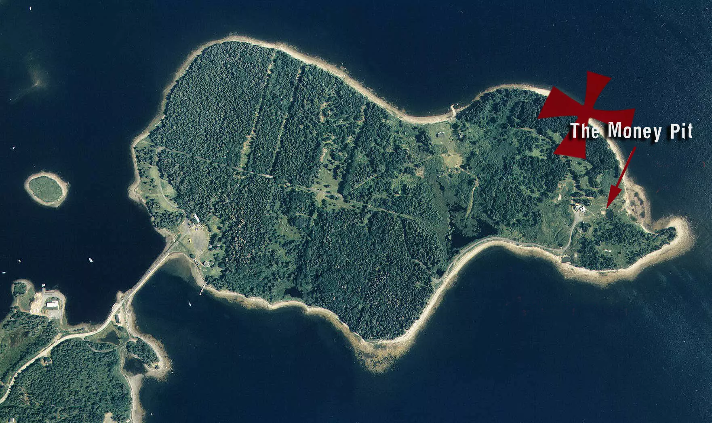
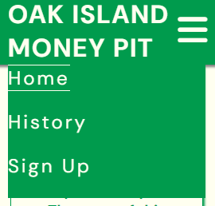
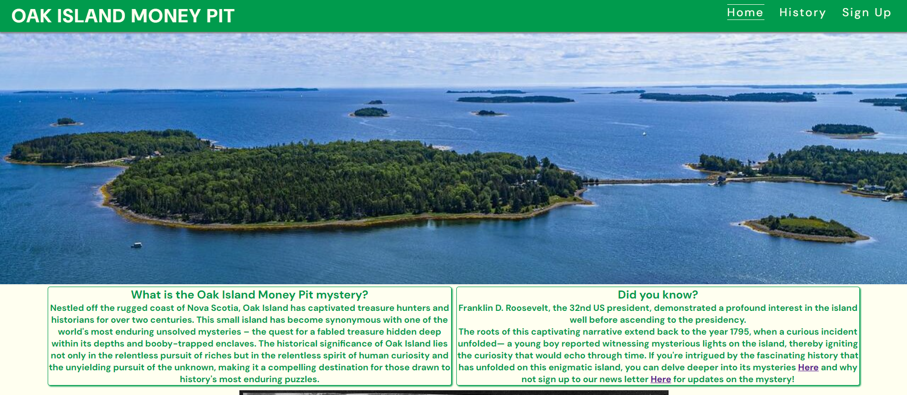
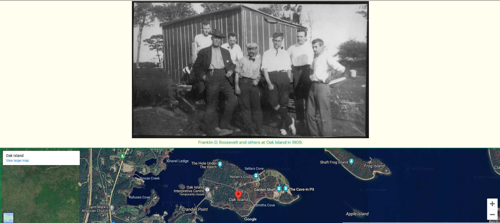
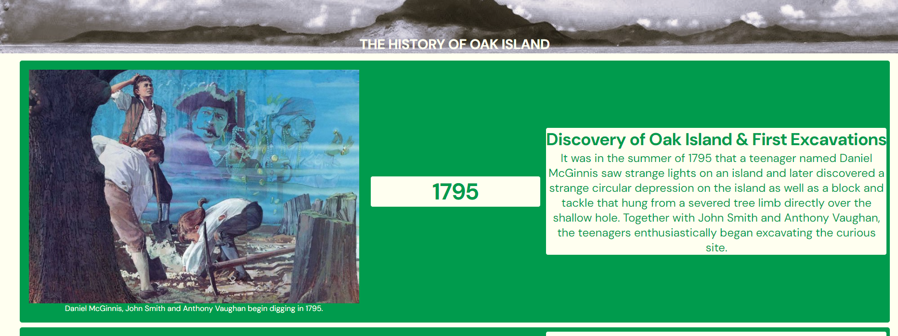
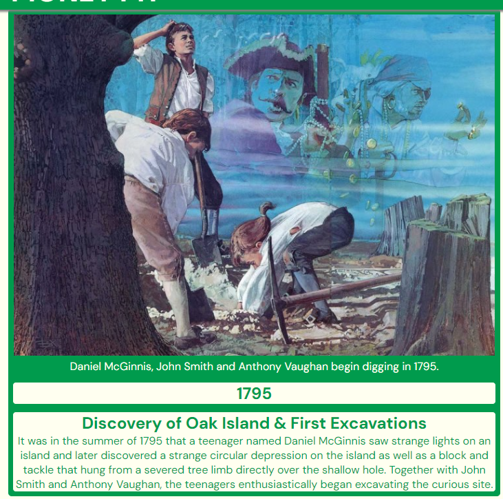
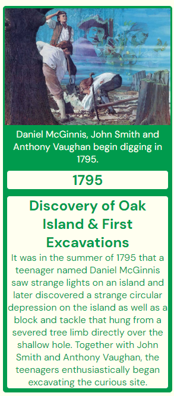
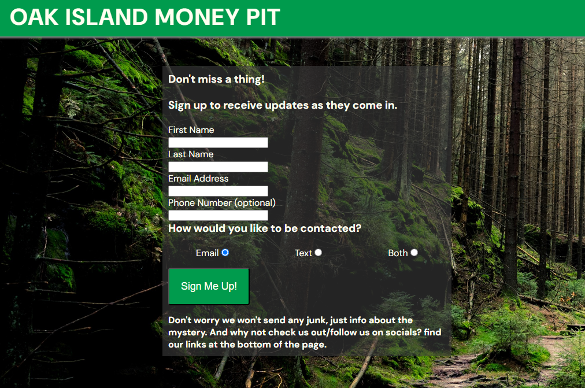
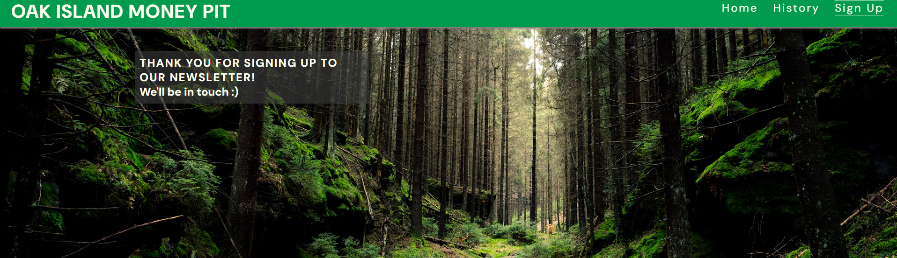

## Overview

Welcome to my website about the Oak Island Money Pit mystery! This README file provides essential information about the website, its purpose, and how to get started.

## Table of Contents

- [Introduction](#introduction)
- [User Stories](#user-stories)
- [Features](#features)
- [Usage](#usage)
- [Installation](#installation)
- [Technologies Used](#technologies-used)
- [Contributing](#contributing)
- [License](#license)
- [Contact](#contact)
- [Credits](#credits)

## Introduction

This Oak Island Money Pit website will allow people to learn more about the mystery of Oak Island and why it has captivated the imaginations of explorers and historians alike for over two centuries. 
The visitors to this website can quickly find key historic milestones in the mystery and sign up for a newsletter for updates as they happen.

The website can be accessed by this [Link](https://allwrightben.github.io/money-pit/)

## User Stories
<h3>First Time Visitor Goals:</h3>
<ul>
<li>

As a first-time visitor, I want to easily understand the main purpose of the site and what it provides.

</li>
<li>

As a first-time visitor, I want to easily navigate through the website

</li>
<li>

As a first-time visitor, I want to quickly find the information I'm looking for.

</li>
</ul>

<h3>Returning Visitor Goals:</h3>
<ul>
<li>

As a returning visitor, I want to see new information relating to the mystery.

</li>
<li>

As a returning visitor, I want to be able to see new updates and to find them easily.

</li>
<li>

As a returning visitor, I want to find community links, So I can learn more about the Organisation and the validity of the information presented.

</li>
<li>

As a returning visitor, I want to continue to see the same clean layout that I liked about my first visit.

</li>
</ul>

<h3>Frequent Visitor Goals:</h3>
<ul>
<li>

 As a frequent visitor, I want to check whether there are any recent discoveries with the Mystery to stay as up-to-date as possible.

</li>
<li>

As a frequent visitor, I want to have options to be notified of any updates.

</li>
</ul>

## Features

<h3>Navbar:</h3>

- Navigation
  - Positioned at the top of the page.Contains the Website name on the left side.
  - Contains navigation links on the right side.
    - HOME - Leads to the home page where they can learn about the mystery
    - HISTORY - Leads to the history page where they can learn about the history of Oak Island.
    - SIGN UP - Leads to the signup page where users can sign up for the newsletter to be notified of updates on the mystery.
  - The links have an animated hover effect  
  - The navigation is clear and easy to understand for the user. 
  
  - The navigation bar is responsive, on tablets the navigation bar makes better use of the space available on a smaller screen for a nicer-looking user experience. 
    
  - On mobile devices:
      - Navigation bar will feature a logo on the left and a hamburger menu on the right. 
      
      - When the hamburger menu is clicked, there is a dropdown menu, making for a more visually pleasing user experience. 
      

- <h3>Home Page</h3>

  - Represent
    - The main purpose of the website.
    - Description of the topic the website was made for.
    - A question to fuel user interest in the mystery.
    - invites to learn more about the history and to sign up to a newsletter.
        
  - Hero Section
    - Hero section has a fixed background image of Oak Island.
    - Hero section has a block section below that consists of two cards of information:
      - One, with information relevant to the topic of the website as an overview.
      - Two, with a "did you know" question to interest the user. The second card also features calls to action invites to learn more about the history or sign up for a newsletter. 
      

  - Under the information card features:
    - An image from the history of Oak Island is relevant to the second card.
    - A Google map to show the user where in the world the island is located.
    

  - Footer
    - Footer contains social media links that open in a new window.
  
  - FOOTER links will have a On-hover feature XXXXXXXXX
    
- <h3>History Page</h3>

  - History page contains:
    - A chronological list of milestone events relating the the Oak Island Money Pit mystery.
    - each section is displayed on a card with an image on the left, the date prominently in the center, and information on the right.
    
    - The History sections are also responsive for tablets.
    
    - The History sections are also responsive for mobile.
    

- <h3>Sign Up Page</h3> 

  - Sign up page contains:
    - A web form to sign up for a newsletter.
    - First name, Last name and email are required fields.
    - Phone number is optional.
    
    - Also features a response page.
    
    - Response page thanks the user and advises we will be in touch. The response page also allows the user to stay on the website, and to go back to continue browsing.

## Usage

[Provide instructions on how to use your website. This can include user guides, examples, or any other relevant information.]

## Installation

[If applicable, provide instructions on how to install or set up your website locally. Include dependencies and any configuration steps.]

## Technologies Used

[List the key technologies and frameworks used in your project.]

- [Technology 1]
- [Technology 2]
- [Technology 3]
- ...

## Contributing

[Provide information for potential contributors. Include guidelines for submitting issues, feature requests, or pull requests.]

## License

[Specify the license under which your website is distributed. For example, MIT License, Apache License 2.0, etc.]

## Contact

[Provide information on how users and developers can get in touch with you. This can include email addresses, social media profiles, or links to a contact form.]

Feel free to reach out if you have any questions or feedback! Thank you for visiting [Your Website Name].

## Credits

<h3>Image credits</h3>

wideisland -
https://wallpapercave.com/beach-wallpaper-1920x1080

oak-island-discovery
dig -
https://www.oakislandmoneypit.com/

laginabrothers
laginabrothers2
partners - 
https://www.history.com/shows/the-curse-of-oak-island/articles/what-is-the-history-of-oak-island

license - 
https://www.oakislandtreasure.co.uk/research-documents/excavations/triton-alliance-stock-certificate/